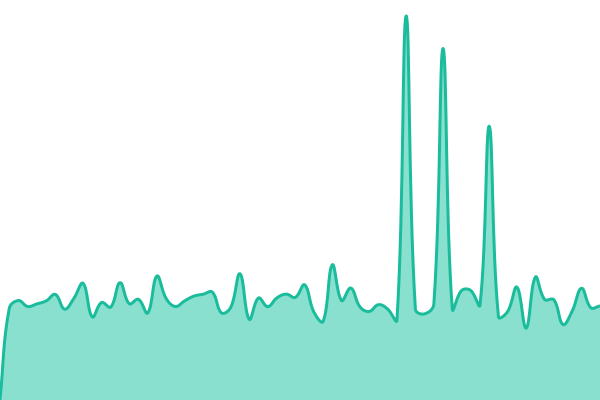
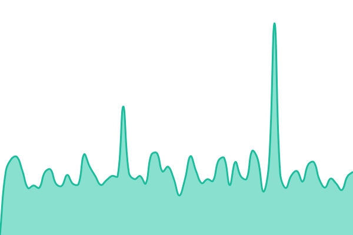
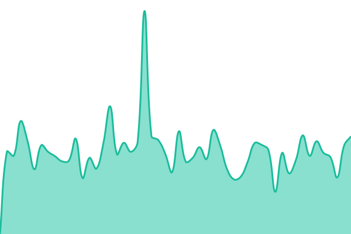
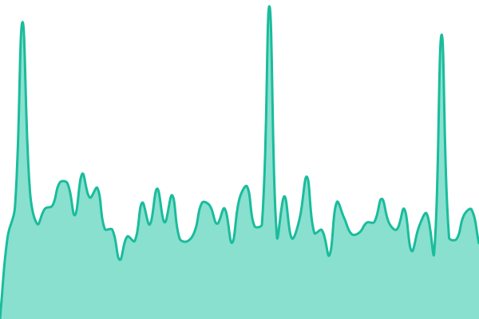
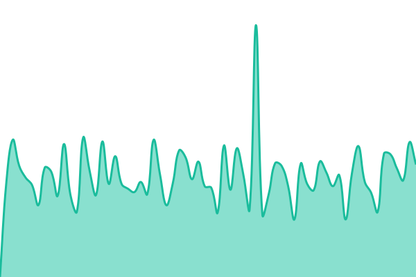
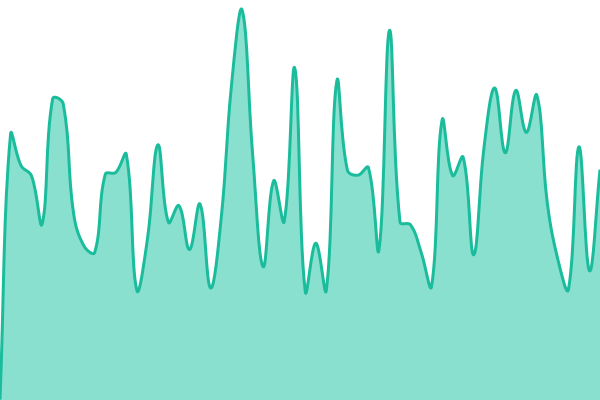
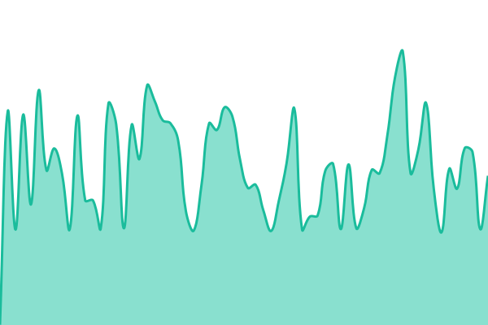
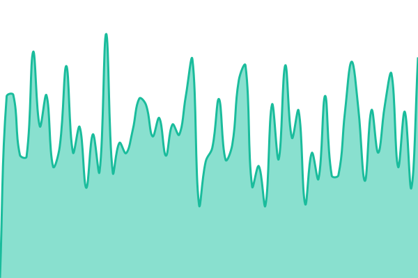
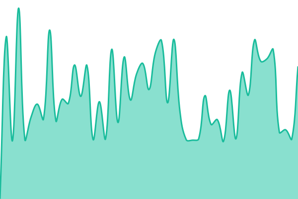
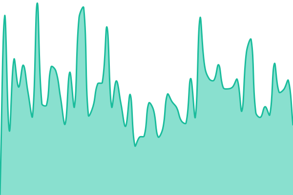

# [📈 État en direct](https://status.alcinae.com): <!--live status--> **Tous les systèmes sont opérationnels**

This repository contains the open-source uptime monitor and status page for [Alcinae Inc.](https://alcinae.com), powered by [Upptime](https://github.com/upptime/upptime).

With [Upptime](https://upptime.js.org), you can get your own unlimited and free uptime monitor and status page, powered entirely by a GitHub repository. We use [Issues](https://github.com/alcinae/status/issues) as incident reports, [Actions](https://github.com/alcinae/status/actions) as uptime monitors, and [Pages](https://status.alcinae.com) for the status page.

## [📈 Live Status](https://demo.upptime.js.org): <!--live status--> **Tous les systèmes sont opérationnels**

<!--start: status pages-->
<!-- This summary is generated by Upptime (https://github.com/upptime/upptime) -->
<!-- Do not edit this manually, your changes will be overwritten -->
<!-- prettier-ignore -->
| URL | Status | History | Response Time | Uptime |
| --- | ------ | ------- | ------------- | ------ |
|  [Alcinae](https://alcinae.com/) | En ligne | [site-alcinae.yml](https://github.com/alcinae/status/commits/HEAD/history/site-alcinae.yml) | 

 817ms
     
 | 

<a href="https://status.alcinae.com/history/site-alcinae">100.00%</a>
    

|  [Ferme de Fontbonne](https://fermedefontbonne.fr/) | En ligne | [site-la-ferme-de-fontbonne.yml](https://github.com/alcinae/status/commits/HEAD/history/site-la-ferme-de-fontbonne.yml) | 

 1187ms
     
 | 

<a href="https://status.alcinae.com/history/site-la-ferme-de-fontbonne">100.00%</a>
    

|  [Challenge](https://challenge.alcinae.com/) | En ligne | [challenge.yml](https://github.com/alcinae/status/commits/HEAD/history/challenge.yml) | 

 1237ms
     
 | 

<a href="https://status.alcinae.com/history/challenge">100.00%</a>
    

|  [Challenge (API)](https://challenge.alcinae.com/api/v1/admin/sync/status) | En ligne | [challenge-api.yml](https://github.com/alcinae/status/commits/HEAD/history/challenge-api.yml) | 

 581ms
     
 | 

<a href="https://status.alcinae.com/history/challenge-api">99.38%</a>
    

|  [PingScore](https://pingscore.alcinae.com/) | En ligne | [pingscore.yml](https://github.com/alcinae/status/commits/HEAD/history/pingscore.yml) | 

 1159ms
     
 | 

<a href="https://status.alcinae.com/history/pingscore">100.00%</a>
    

|  [PingScore (API)](https://pingscore.alcinae.com/api/version) | En ligne | [pingscore-api.yml](https://github.com/alcinae/status/commits/HEAD/history/pingscore-api.yml) | 

 590ms
     
 | 

<a href="https://status.alcinae.com/history/pingscore-api">98.46%</a>
    

|  [France Appro](https://franceappro.alcinae.com/) | En ligne | [boutique-en-ligne.yml](https://github.com/alcinae/status/commits/HEAD/history/boutique-en-ligne.yml) | 

 1310ms
     
 | 

<a href="https://status.alcinae.com/history/boutique-en-ligne">100.00%</a>
    

|  France Appro (API) | En ligne | [boutique-en-ligne-api.yml](https://github.com/alcinae/status/commits/HEAD/history/boutique-en-ligne-api.yml) | 

 539ms
     
 | 

<a href="https://status.alcinae.com/history/boutique-en-ligne-api">99.56%</a>
    

|  [France Appro (Admin)](https://franceappro.alcinae.com/admin/) | En ligne | [franceappro-admin.yml](https://github.com/alcinae/status/commits/HEAD/history/franceappro-admin.yml) | 

 613ms
     
 | 

<a href="https://status.alcinae.com/history/franceappro-admin">100.00%</a>
    

|  [Forms](https://forms.alcinae.com/f/) | En ligne | [forms-respondent.yml](https://github.com/alcinae/status/commits/HEAD/history/forms-respondent.yml) | 

 832ms
     
 | 

<a href="https://status.alcinae.com/history/forms-respondent">100.00%</a>
    

|  [Forms (Admin)](https://forms.alcinae.com/admin/) | En ligne | [forms-admin.yml](https://github.com/alcinae/status/commits/HEAD/history/forms-admin.yml) | 

 460ms
     
 | 

<a href="https://status.alcinae.com/history/forms-admin">100.00%</a>
    

|  [Authentification](https://auth.alcinae.com/realms/alcinae/.well-known/openid-configuration) | En ligne | [authentification.yml](https://github.com/alcinae/status/commits/HEAD/history/authentification.yml) | 

 811ms
     
 | 

<a href="https://status.alcinae.com/history/authentification">100.00%</a>
    

|  CDN | En ligne | [medias.yml](https://github.com/alcinae/status/commits/HEAD/history/medias.yml) | 

 750ms
     
 | 

<a href="https://status.alcinae.com/history/medias">100.00%</a>
    

<!--end: status pages-->

[**Visit our status website →**](https://status.alcinae.com)

## 📄 License

- Powered by: [Upptime](https://github.com/upptime/upptime)
- Code: [MIT](./LICENSE) © [Anand Chowdhary](https://anandchowdhary.com)
- Data in the `./history` directory: [Open Database License](https://opendatacommons.org/licenses/odbl/1-0/)
